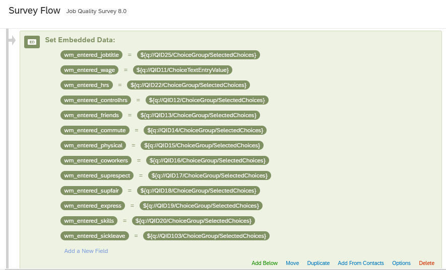

## PHP script for running conjoint experiments via Qualtrics

NOTE BEFORE ALL THIS: Qualtrics does an annoying thing with the data it collects, where if you change the wording of a question even a little bit after you've already published it, it treats all responses to the previously-worded version as in the "trash bin", so you have to do some work to go and re-include that data in the final dataset. Because of this, I highly recommend just duplicating the survey if you want to make a change, and calling the new one version 2, version 3, etc. (since the variables it generates when calling web services can be kind of dauntingly-named to begin with)

1. (The hard part) You'll need a PHP-enabled web server on which the .php script will live. For example, I just put it in the `public_html` subfolder of my home folder on the Textlab server, so that the URL to access it was https://textlab.econ.columbia.edu/~jjacobs/handle_qualtrics.php. If you don't have access to a server like this, there are ways to host .php scripts for free (like Heroku) that I'm happy to show yall.
2. Once the .php file is in a web-accessible folder, you'll need to modify the lists at the top so that they contain the characteristics (the array keys) and the list of values for each characteristic (the array values). So if you have characteristics A, B, and C, with values like a1, a2, a3, b1, b2, b3, and c1, c2, c3, the array at the top would look like:

```php
characteristics = array(
    "A" => ["a1","a2","a3"],
    "B" => ["b1","b2","b3"],
    "C" => ["c1","c2","c3"]
);
```

Once that array is set up, all that's left is stuff on the Qualtrics survey flow editor side.

3. The first step once you have the Qualtrics page open is to click "Flow" at the top of the survey editor. In this first Set Embedded Data block I'm just giving explicit names like `wm_entered_jobtitle` to the responses given to the survey questions up to that point:



4. Next you'll need to create a Web Service call block and (importantly) specify every variable from the survey that you want to send to the .php script:


5. Next, you'll need to specify what Qualtrics should call the variables sent *back* to it as the response from the .php script. So, for example, I made variables in Qualtrics called like `${generatedWage}`, `${generatedCommute}`, etc.


6. Once you've finished this mapping from variables returned by the .php script to variables in Qualtrics, you can use them on any subsequent page! I'm also including the HTML code for the tables we generated here, in `table_code.html`, so you can see what that looks like, since it's a bit of a weird fusion of HTML code and Qualtrics-specific variable reference code. The table as it's set up there will look weird in the preview -- it will look like there are headers on both the left side and above each row -- but that's because it's set up to be responsive, meaning that if someone is viewing the survey on mobile it will auto-adjust the table setup so that they don't have to scroll left to right on their phone:

